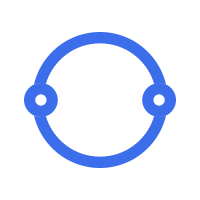
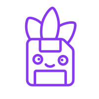

  
  <h1>小圆圈</h1>

## 简介

 小圆圈，是一个校园社区平台。定位是校园交流社区。主要功能包括发帖，评论点赞等。圈子有推荐贴、表白墙贴、失物招领贴、校园新闻贴等分类。平台可根据需求进行功能扩展。

## 项目技术栈

### 前端

项目采用  Vue 3 进行开发，集成了  Axios 作为请求工具，使用  Pinia 进行状态管理，并通过  Pinia Persistedstate 实现状态的持久化存储。路由管理则采用  VueRouter 4，确保应用页面的高效切换和管理。

### 后端

后端基于  Node.js 开发，整合了  Express 框架构建  RESTful API，使用  MySql2 进行数据库操作，并通过  jsonwebtoken 实现用户身份验证和授权，确保数据安全。
